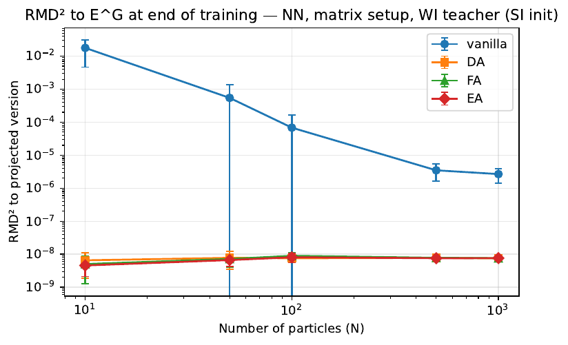
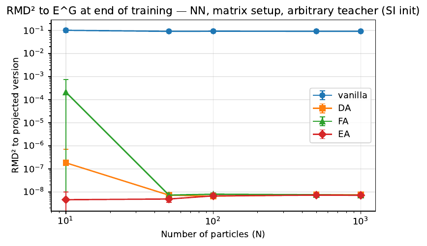
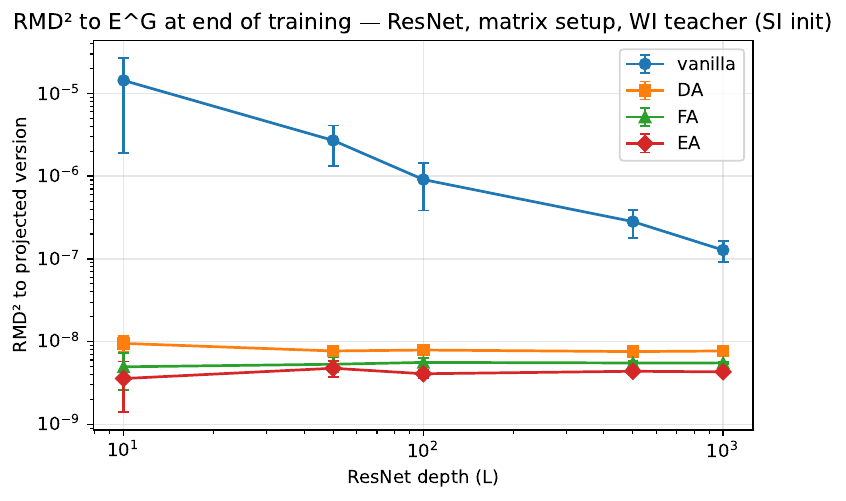

# DOLA — Symmetry leveraging in mean-field neural networks

[](https://github.com/Kikidu59/dola/actions/workflows/tests.yml)


[](LICENSE)

A JAX implementation and numerical study of how **symmetry-leveraging techniques** — data augmentation (DA), feature averaging (FA) and equivariant architectures (EA) — shape the training dynamics of overparametrized networks in the **mean-field regime**.

The project reproduces the teacher–student experiments of
[Maass Martínez & Fontbona, *Symmetries in Overparametrized Neural Networks: A Mean-Field View* (NeurIPS 2024)](https://arxiv.org/abs/2405.19995)
for shallow networks, and **extends them to deep ResNets in the mean-ODE scaling**, where each residual block is itself a mean-field layer of particles.

## Highlights

- **From-scratch JAX implementation** of mean-field shallow networks and mean-ODE ResNets, with `vmap` over particles, `lax.scan` over depth and `jit`-compiled SGD/SGLD steps.
- **Four training schemes** (vanilla, DA, FA, EA) plugged in as interchangeable loss functions, under two jointly-equivariant activations and two initialisations (weakly / strongly invariant).
- **Optimal-transport metrics** (Wasserstein-2 and its normalised version, RMD) to measure how far the learned particle distribution is from the invariant subspace E^G.
- **96 unit tests**, including checks of the mathematical properties themselves: joint equivariance of the activation, equivariance of the FA model, invariance of E^G under EA training, idempotence of the projection.
- **Reproducible experiment pipeline**: one script regenerates every figure with fixed seeds, and runs on SLURM clusters either on a GPU node or as an 8-task CPU job array.

## Setting in one paragraph

A network is described by a cloud of N particles θᵢ ∈ ℝ^{2×2}, and its output is the average Φ(x) = (1/N) Σᵢ σ\*(x, θᵢ).
The group G = C₂ (swapping the two coordinates of ℝ²) acts on inputs, outputs and particles, and the activation σ\* is jointly equivariant.
Particles that are fixed by this action form a linear subspace E^G; a network whose particles all lie in E^G is *strongly invariant*.
The question is: starting from particles in E^G, does training keep them there — and which symmetry-leveraging scheme guarantees it, depending on whether the target function is itself equivariant?
For the ResNet, the same question is asked layer by layer, with h_l = h_{l−1} + (α / LM) Σᵢ σ\*(h_{l−1}, z^{i,l}).

More details on the code structure are in [`docs/architecture.md`](docs/architecture.md).

## Results

All runs start from a strongly invariant initialisation (particles in E^G) and report RMD² to E^G at the end of training, averaged over 10 seeds.

| Shallow network, **equivariant** (WI) teacher | Shallow network, **arbitrary** teacher |
|:---:|:---:|
|  |  |

- With an **equivariant teacher**, vanilla SGD drifts away from E^G at small width, but the drift vanishes as N grows: in the mean-field limit, plain training already preserves the symmetry. DA, FA and EA stay in E^G up to numerical precision at every width.
- With an **arbitrary teacher**, vanilla training leaves E^G (RMD² ≈ 10⁻¹), whereas DA and FA return to E^G as soon as the network is wide enough, and EA stays there by construction.

| ResNet, **equivariant** (WI) teacher |
|:---:|
|  |

- The same picture holds for **deep ResNets**: the vanilla drift away from E^G shrinks with depth L, while DA, FA and EA keep every layer in E^G. This supports extending the shallow-network result to ResNets in the mean-ODE limit.

The full set of 16 figures (both activations, both teachers, both architectures, plus loss curves) is in [`figures/`](figures/).

## Getting started

The project uses [uv](https://docs.astral.sh/uv/) and Python 3.13.

```bash
git clone https://github.com/Kikidu59/dola.git
cd dola
uv sync              # creates .venv with the locked dependencies
uv run pytest        # 96 tests, about 2 minutes on a laptop CPU
```

Without uv: `pip install -r requirements.txt` in a Python 3.13 environment.

### Reproducing the figures

```bash
# Smoke test: tiny sizes, a couple of minutes
uv run python scripts/reproduce_figures.py --quick --outdir /tmp/figures

# Full sweep (heavy: widths/depths up to 1000, 10 seeds)
uv run python scripts/reproduce_figures.py --reps 10 --outdir figures

# A single block, e.g. ResNet / matrix activation / WI teacher
uv run python scripts/reproduce_figures.py --setup matrix --arch ResNet --teacher WI
```

On a SLURM cluster, from the repository root:

```bash
sbatch cluster/jed_figures.sh    # CPU: 8-task job array, one (setup × arch × teacher) block per task
sbatch cluster/izar_figures.sh   # GPU: single job
```

### Using the library

```python
import jax
import src.spaces as spaces
from src.teacher import make_wi_particles
from src.training import train, loss_fn_fa, DEFAULT_CONFIG
from src.metrics import rmd_to_projected

spaces.SETUP = spaces.make_setup_matrix()          # or make_setup_uv()

history = train(
    teacher_particles=make_wi_particles(),
    N=100,
    key=jax.random.PRNGKey(0),
    config={**DEFAULT_CONFIG, "T": 5.0},
    init_type="si",                                # start in E^G
    used_loss_fn=loss_fn_fa,                       # feature averaging
)
print(rmd_to_projected(history["particles"][-1]))  # distance to E^G
```

## Repository layout

```
src/            core library
  spaces.py       group action, activations, projection onto E^G
  model.py        shallow mean-field network and mean-ODE ResNet
  teacher.py      teacher networks and data sampling
  loss.py         quadratic loss and regularisation
  training.py     vanilla / DA / FA / EA losses, SGD-SGLD step, training loops
  metrics.py      W₂, RMD and L² distances
  utils.py        plotting helpers
scripts/        reproduce_figures.py — regenerates every figure
cluster/        SLURM scripts (Izar GPU, Jed CPU job array)
notebooks/      exploratory analysis and hyperparameter tuning
figures/        generated figures (PDF)
tests/          pytest suite
docs/           architecture notes and README images
```

## Reference

```bibtex
@inproceedings{maass2024symmetries,
  title     = {Symmetries in Overparametrized Neural Networks: A Mean Field View},
  author    = {Maass Mart{\'i}nez, Javier and Fontbona, Joaquin},
  booktitle = {Advances in Neural Information Processing Systems},
  year      = {2024}
}
```

## License

[MIT](LICENSE)
